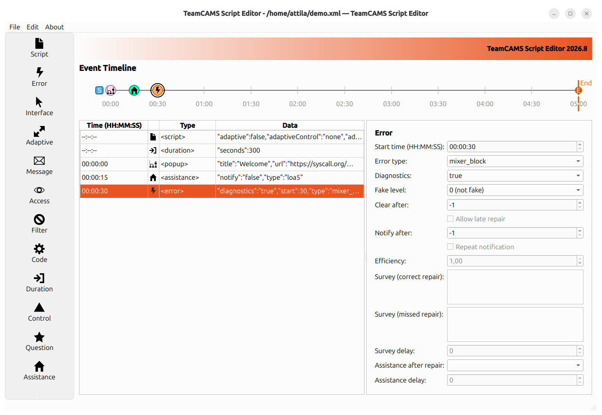

# TeamCAMS Script Editor

TeamCAMS Script Editor is a graphical authoring tool for creating and editing TeamCAMS experimental scenarios.

As part of the latest generation of the TeamCAMS platform, which evolved from the AutoCAMS 2.0 research environment, the editor provides researchers with a visual timeline-based interface for designing and configuring experimental sessions without manually editing configuration files. It is fully integrated with the TeamCAMS ecosystem and supports the creation of complex studies involving automation, teamwork, human-AI interaction, and distributed experimentation.

## Features

- Visual timeline-based scenario editor.
- Creation and modification of experimental scripts.
- Configuration of faults, events, messages, questionnaires, and automation settings.
- Support for complex experimental protocols.
- Validation of scenario definitions through a graphical interface.
- Export of TeamCAMS-compatible experiment scripts.
- Designed for use with TeamCAMS Experiment Manager.

## Purpose

The Script Editor is intended for researchers who need to design experimental conditions and define what happens during a TeamCAMS session.

Using the editor, researchers can create complete study scenarios by specifying:

- Timing of events.
- Fault injection schedules.
- Automation level changes.
- Adaptive automation settings.
- Participant instructions.
- Messaging events.
- Questionnaire administration.
- Training and tutorial elements.

The resulting script can then be loaded into the TeamCAMS Experiment Manager and executed with one or more participants.

## How It Fits Into TeamCAMS

The TeamCAMS ecosystem consists of four main components:

### Script Editor

This application.

Used to create and edit experimental scenarios.

### Experiment Manager

The researcher-facing application used to configure and supervise experiments.

Repository:

https://github.com/slashdotted/TeamCAMS-Manager

### Operator Interface

The participant-facing web application used during experimental sessions.

Repository:

https://github.com/slashdotted/TeamCAMS-OperatorInterface

### Log Processor

Used after data collection to process and extract information from TeamCAMS log files.

Repository:

https://github.com/slashdotted/TeamCAMS-LogProcessor

## Typical Workflow

The typical workflow is:

1. The researcher launches TeamCAMS Experiment Manager on a local computer.
2. An experimental script or scenario is selected.
3. Participant accounts and operator access permissions are configured.
4. The experiment is started from the manager.
5. A participation link is shared with external participants.
6. Participants join through the web-based operator interface without installing any software.
7. Experimental data and event logs are automatically collected during the session.
8. The generated log files are processed using the Log Processor.
9. Extracted datasets are imported into statistical or data analysis software.

## Screenshot

### Main Window

The visual editor provides a timeline-based view of the study configuration and allows researchers to manage experimental events, automation settings, participant interactions, and other scenario elements.

## Research Background

TeamCAMS (Team Cabin Air Management System) is a research platform developed to investigate human behavior in complex socio-technical environments, including teamwork, automation, adaptive automation, and human-AI interaction. The scripting system was designed to give researchers full control over experimental conditions while keeping scenario creation accessible through a graphical interface.

The current TeamCAMS platform has been developed since 2015 by **Amos Brocco** as part of a collaboration between:

- Cognitive Ergonomics and Work Psychology Team, Department of Psychology, University of Fribourg, Switzerland
- Department of Innovative Technologies, University of Applied Sciences and Arts of Southern Switzerland (SUPSI)

## Supported Platforms

Currently distributed for:

- Linux
- Windows

The application is designed as a cross-platform tool.

## License

TeamCAMS Experiment Manager is released under the terms of the GNU General Public License v3.0 (GPL-3.0).

See the `LICENSE.txt` file for details.

## Citation

If you use TeamCAMS in scientific work, please cite the corresponding TeamCAMS publication once available.

## Contacts

**Software development and project information**  
Amos Brocco  
Department of Innovative Technologies (SUPSI)  
Email: amos.brocco [at] supsi [dot] ch

**Scientific inquiries, research use, and collaborations**  
Cognitive Ergonomics and Work Psychology Team  
Department of Psychology, University of Fribourg, Switzerland  
https://www.unifr.ch/psycho/en/department/staff/teams/cogerg.html
